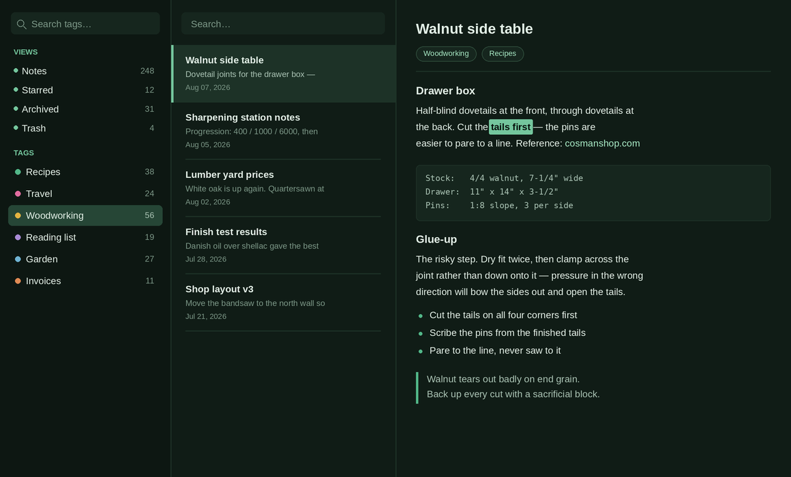

# Dark Green

A dark forest-green theme for Standard Notes.

Green-tinted surfaces instead of flat grey, a moss-and-fern accent palette, and
a tag list where you can always tell which row is selected. Works on web,
desktop, and mobile.



## Install

Preferences → General → Advanced Settings → Install Custom Plugin, then paste:

```
https://cdn.jsdelivr.net/gh/lelandsanders/SN-theme-dark-green@main/ext.json
```

Activate it under Appearance → Themes.

## Why another dark theme

Most dark themes for Standard Notes leave `--navigation-item-selected-background-color`
at its default. That value is hardcoded to a near-white in the app's own
stylesheet and does not adapt, so the selected tag turns into a bright bar in
an otherwise dark sidebar. This theme overrides it with the lightest surface in
the palette on the darkest — readable, but not blinding.

A few other details that tend to get missed:

- The passive color scale is set explicitly. The app renamed these from
  `--sn-stylekit-grey-*` to `--sn-stylekit-passive-color-*`; both are defined
  here so older editor plugins still pick up colors.
- `--sn-stylekit-theme-type: dark` is set, which the client uses for icon and
  status bar handling.
- Tag swatches lead with green, then pink, amber, violet, sky, and rust —
  spaced far apart in hue so a heavily tagged sidebar stays scannable.

## Palette

| Role | Hex |
| --- | --- |
| Navigation background | `#0d1712` |
| App / editor background | `#101c16` |
| Raised surface | `#16261e` |
| Hover | `#1d3227` |
| Selected | `#264636` |
| Primary text | `#e2efe6` |
| Secondary text | `#a9c2b3` |
| Accent (fern) | `#52b788` |
| Highlight (moss) | `#74c69d` |
| Link (mint) | `#a7e8c4` |

## Customizing

Fork the repo and edit the palette block at the top of `dark-green.css`.
Everything below it references those variables, so one hex change repaints the
whole theme.

For live experimentation, open the desktop app's dev tools
(View → Toggle Developer Tools), find `:root` in the Styles panel, and edit the
variables directly. Changes apply instantly.

To publish your own version, update `identifier`, `name`, and all four URLs in
`ext.json` to point at your fork.

## Repo layout

```
SN-theme-dark-green/
├── dark-green.css   the theme
├── ext.json         plugin descriptor
├── package.json     version + sn.main
├── preview.png
├── README.md
└── LICENSE
```

## Releasing

1. Bump `version` in both `package.json` and `ext.json` — they must match.
2. Update the version in `ext.json`'s `url`, `download_url`, and `thumbnail_url`.
3. Commit and push, **then** tag. Tagging before the files are committed leaves
   the tag pointing at the wrong commit and every URL 404s.
4. Publish a GitHub Release for the tag so the desktop app has a zip to fetch.

## Troubleshooting

**Theme appears in the list but nothing changes.** The descriptor imported but
the stylesheet 404'd. Check that the tag in `url` exists and contains the CSS:

```
curl -sI https://cdn.jsdelivr.net/gh/lelandsanders/SN-theme-dark-green@v1.1.0/dark-green.css
```

**Edits don't show up.** jsDelivr caches branch URLs for up to a week. Purge it:

```
https://purge.jsdelivr.net/gh/lelandsanders/SN-theme-dark-green@main/dark-green.css
```

**Mobile still shows the old version.** The mobile app caches themes
indefinitely. Long-press the theme name in the themes list to force a
re-download.

## License

MIT
